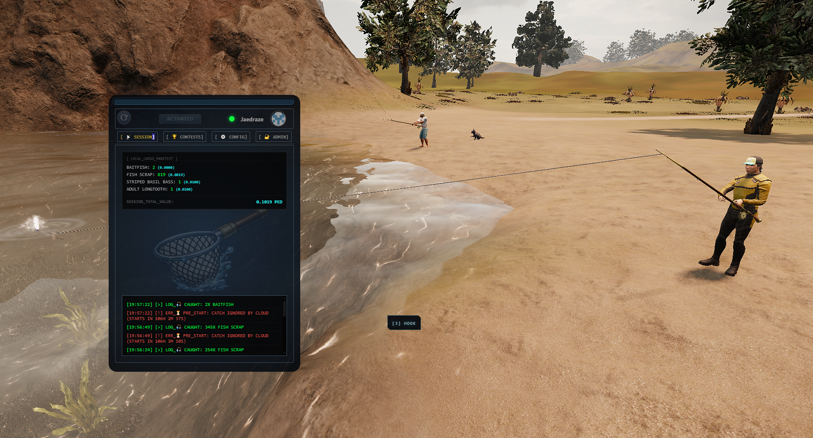
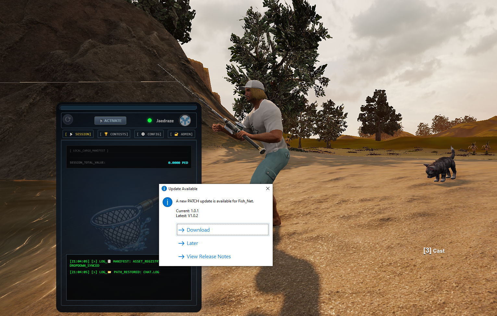
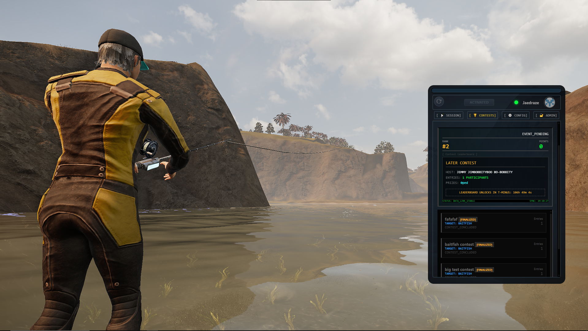
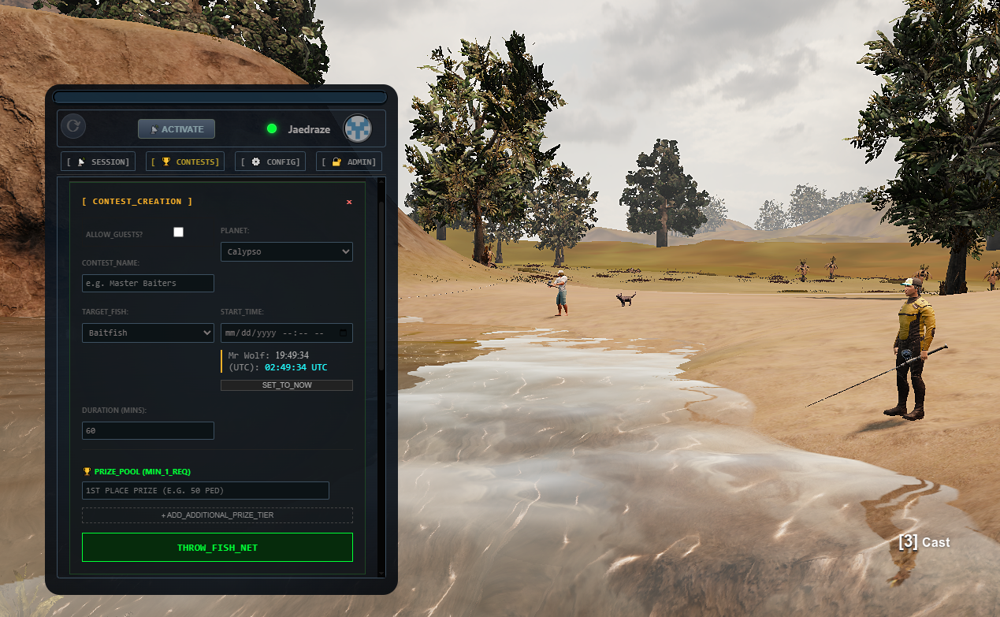
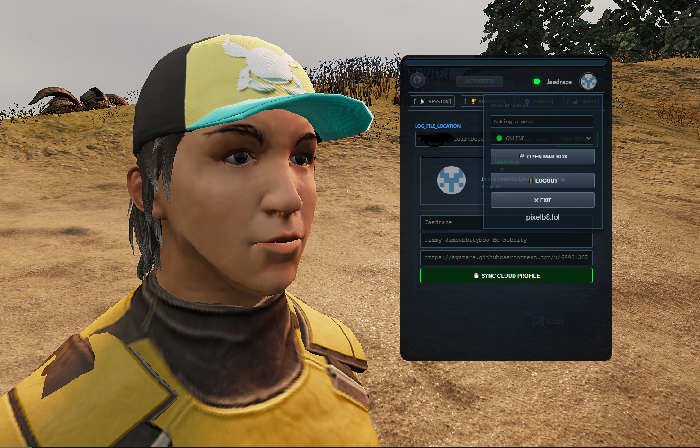
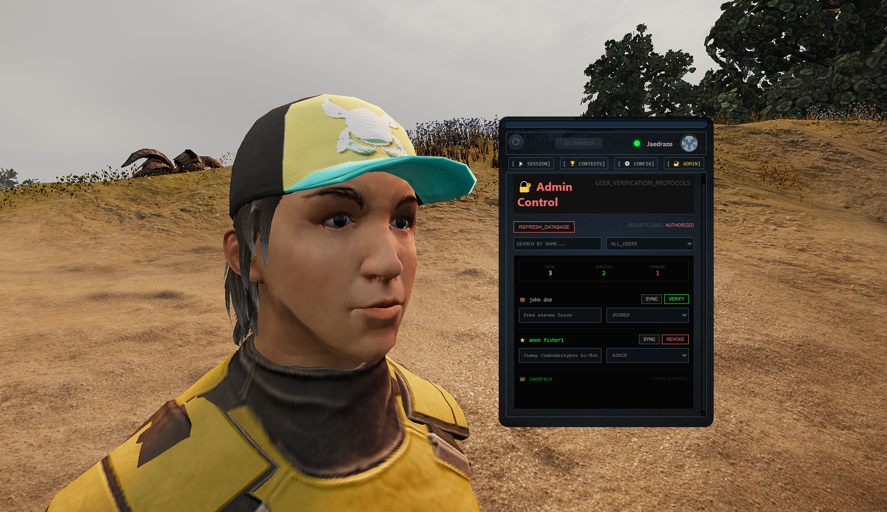

# 🎣 PIXELB8: Fish_Net
**A Fishing Contest Monitor Concept for Entropia Universe**

Fish_Net is a lightweight, desktop HUD concept designed for Entropia Universe fishing event organizers. It monitors local game logs in real-time to track catches and syncs data to a global contest leaderboard.

all participants must have the app installed, they may also require Entropia Name verification by a mod, admin or ceo Role
login is required but there is an option for anonymous logins, if you do not wish to login wiht github, a user may create an anonymous account by typing their entropia name and a display name into the fields in the config tab, then click start fishing.

once you have logged in via github or anon device account, you should only be required to click the initialize button on the main tab to start tracking.

contest hosts can create contests on the contest tab, regular users can browse and join contests on the same tab.
If you want a contesthost role, simply ask me or any admin (currently only me)

you can contact me via discord at Jaedraze, or twitch.tv/jaedraze or type /w Jimmy jimbobbityboo bo-bobbity ingame!  

## ✨ Features
* **Dual-Clock Sync:** View local time and Entropia UTC (Game Time) side-by-side for perfect contest scheduling.
* ** Architecture:** Built with Vanilla JS/HTML/CSS—zero bloated frameworks.
* **Live Log Monitoring:** Automatically detects catches from your `Chat.log` file.
* **Auto-Updates:** Integrated with GitHub Releases to ensure you always have the latest contest logic.

## 🚀 Installation
1.  Download the latest `Fish_Net_Setup.exe` from the [Releases](https://github.com/YOUR_USERNAME/fishing-scout-omega/releases) page.
2.  Run the installer (requires Admin privileges for Program Files access).
3.  Launch **Fish_Net** and point it to your Entropia Universe log folder.
4. login via github or the anonymous login on the config page
5. you can now exit, and launch the app whenever and simply click initialize and browse contests
